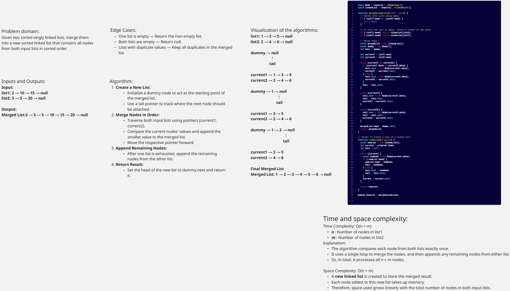
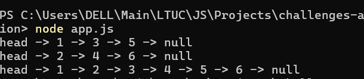
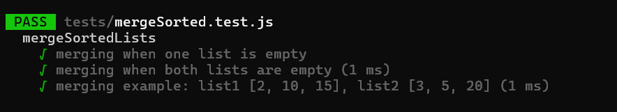

# Linked List Merge Sorted Lists

Given two sorted singly linked lists, merge them into a new sorted linked list that contains all nodes from both input lists in sorted order.

## mergeSortedLists(list1, list2)

## Console Screenshot

## Unit Tests With Jest Screenshot

