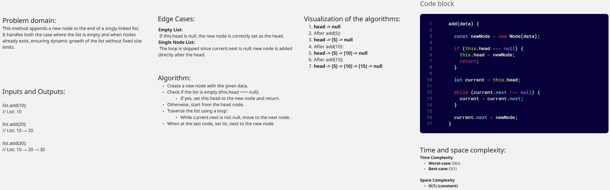
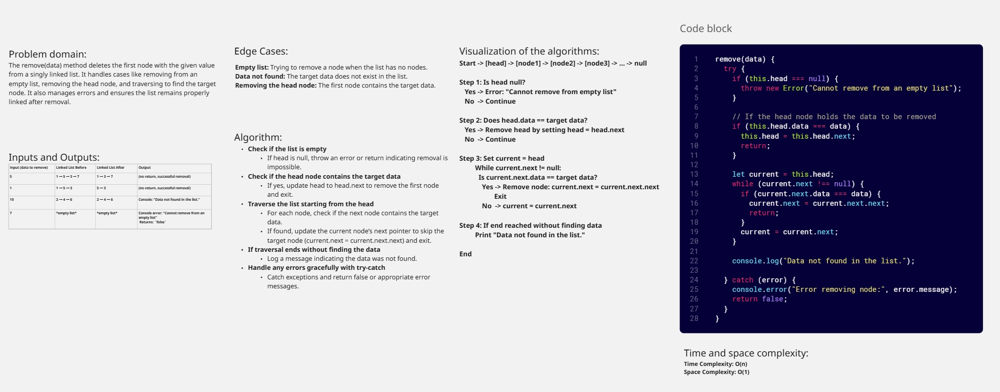
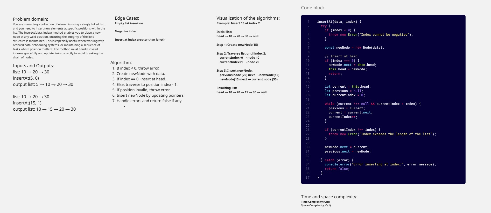
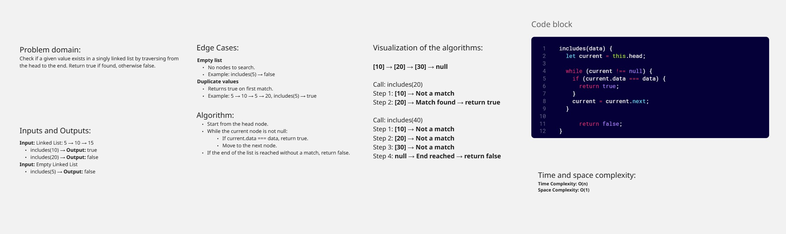
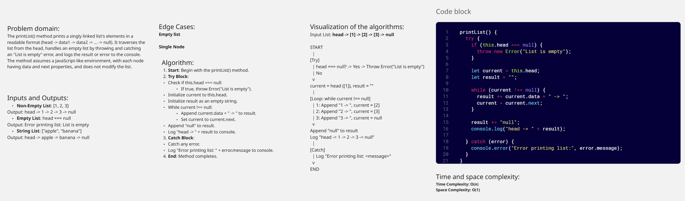
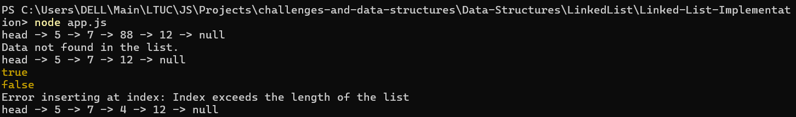
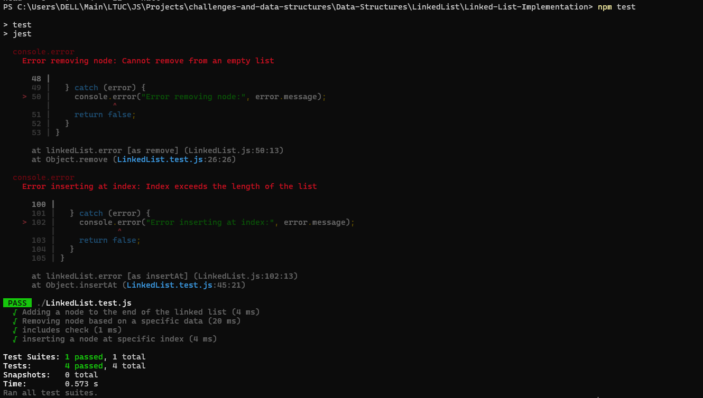

# Linked-List-Implementation

## Implement a singly linked list data structure in javascript.

>- The Node class should have properties for storing data and a reference to the next node in the linkedlist.
>- The LinkedList class should have a property Node head to store the head of the linkedlist.
>- The LinkedList class should support functions to:
>- add(data): Add a new node with the specified data to the end of the linkedlist.
>- remove(data): Remove the first node with the specified data from the linkedlist.
>- printList(): Print the contents of the list in order.
>- includes(data): Check if the linked List contains a node with the specified value.
>- insertAt(data, index): Insert a new node with the specified data at the specified index in the linkedlist.

## add method

## remove method

## insertAt method

## includes method

## printList method

## Console Screenshot

## Unit Tests With Jest Screenshot

