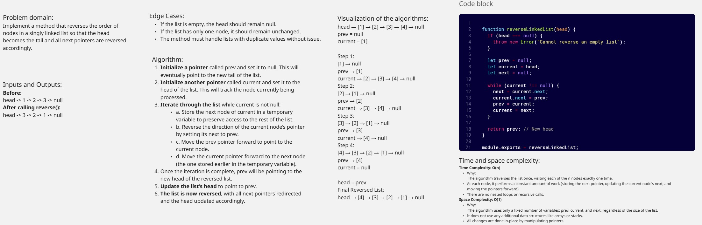
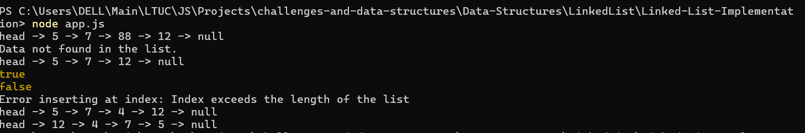
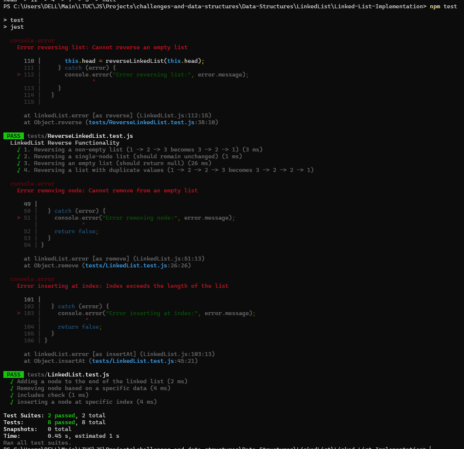

# Linked List Reverse

Use your previous linked list implementation to include a function that reverses the linked list. The function should not create a new list but it should reverse the linked list itself.

## Reverse()

## Console Screenshot

## Unit Tests With Jest Screenshot

