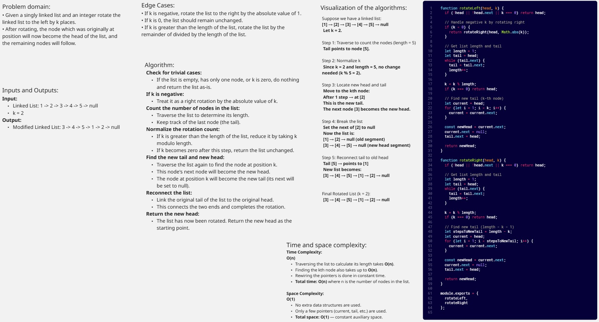
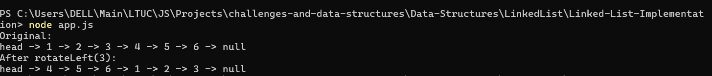
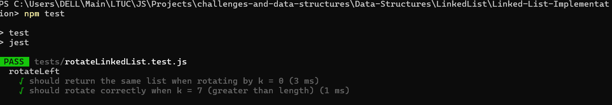

# Linked List Rotate by K

Given two sorted singly linked lists, merge them into a new sorted linked list that contains all nodes from both input lists in sorted order.

## rotateLeft, rotateRight

## Console Screenshot

## Unit Tests With Jest Screenshot

