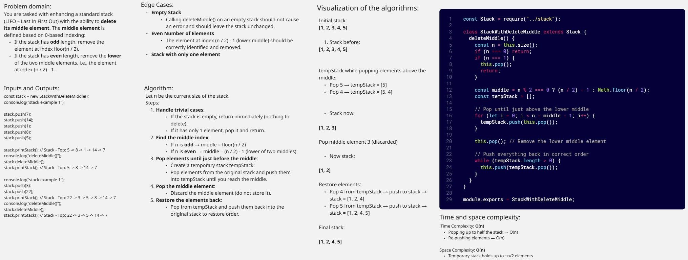
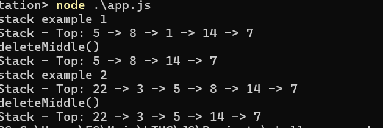
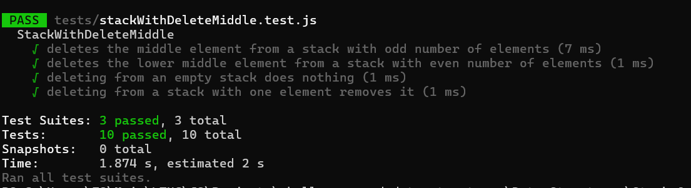

# Stack and Queue Implementation

## Stack Challenge: Delete Middle Element of a Stack

Implement a method to delete the middle element of a stack in JavaScript. If the stack has an even number of elements, remove the lower middle element.

## StackWithDeleteMiddle

## Console Screenshot

## Unit Tests With Jest Screenshot

