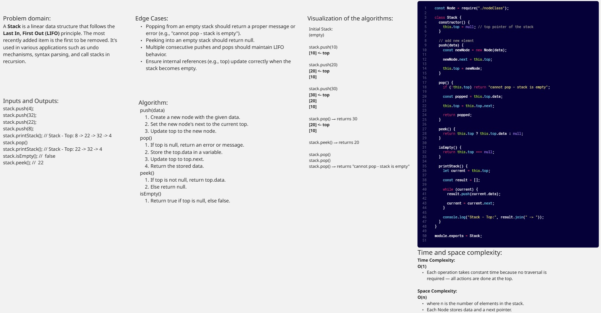
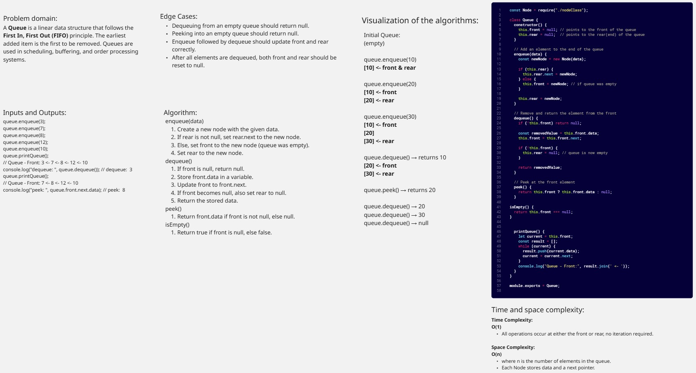
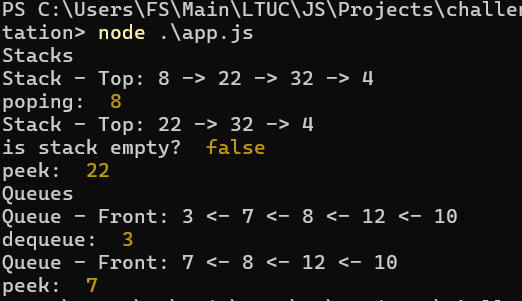
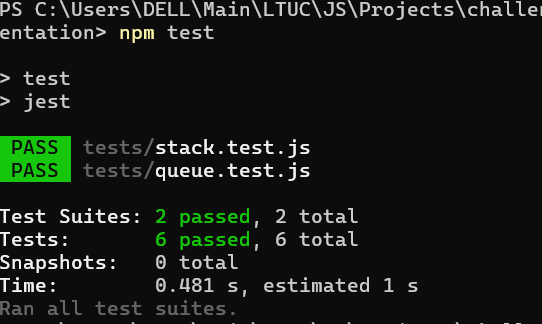

# Stack and Queue Implementation

Both Stack and Queue are fundamental linear data structures used to manage collections of data with specific access patterns:

>- A Stack operates on a Last In, First Out (LIFO) basis, meaning the most recently added item is the first to be removed. It is commonly used for managing function calls (call stack), undo operations in editors, and parsing expressions.
>- A Queue operates on a First In, First Out (FIFO) basis, meaning the earliest added item is the first to be removed. It is used in scheduling tasks, managing requests in order (like print queues or server requests), and breadth-first search in graphs.

## Stack

## Queue

## Console Screenshot

## Unit Tests With Jest Screenshot

