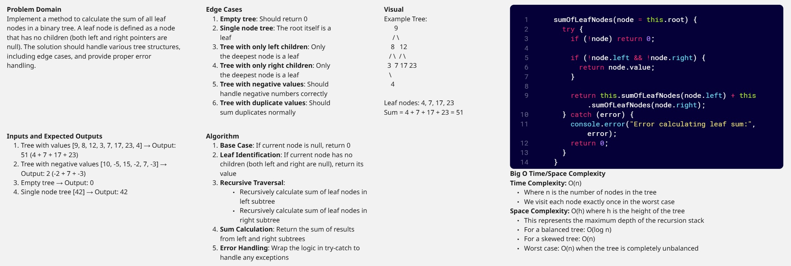
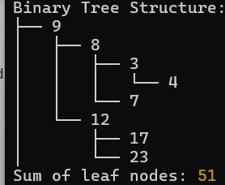
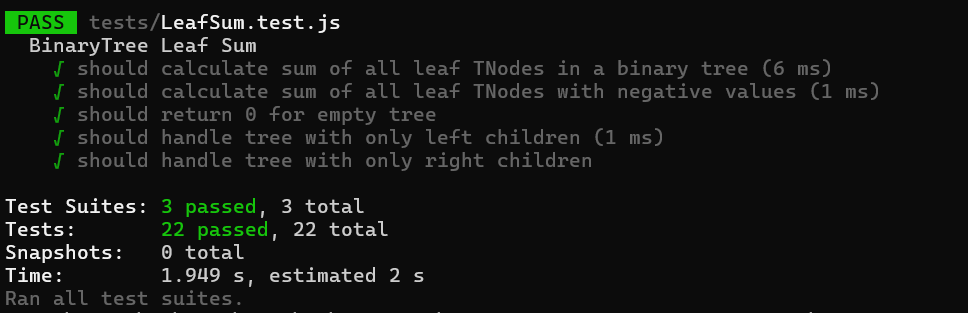

# Binary Tree Second Max Value

Implement a method to calculate the sum of all leaf nodes in a binary tree. A leaf node is defined as a node that has no children (both left and right pointers are null). The solution should handle various tree structures, including edge cases, and provide proper error handling.

## findSecondMax()

## Console - Screenshot

## Unit Tests With Jest - Screenshot

