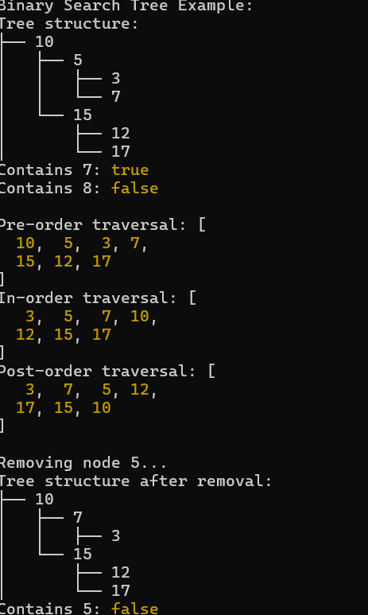

# Binary Tree and Binary Search Tree Implementation

Implement a binary tree and binary search tree (BST) with the following methods:

- BinaryTree: Pre-order, in-order, post-order traversals, and print functionality.
- BinarySearchTree: Add, contains, and remove methods while maintaining BST properties.

## Queue

## Console - Screenshot

## Unit Tests With Jest - Screenshot

