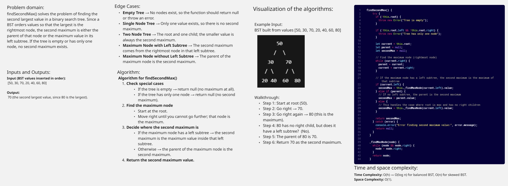
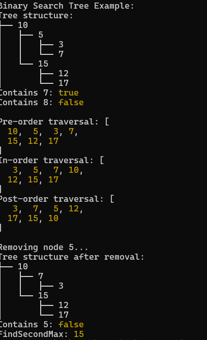
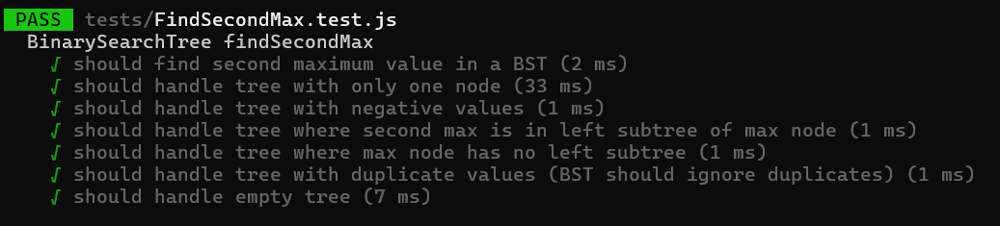

# Binary Tree Second Max Value

findSecondMax() solves the problem of finding the second largest value in a binary search tree. Since a BST orders values so that the largest is the rightmost node, the second maximum is either the parent of that node or the maximum value in its left subtree. If the tree is empty or has only one node, no second maximum exists.

## findSecondMax()

## Console - Screenshot

## Unit Tests With Jest - Screenshot

