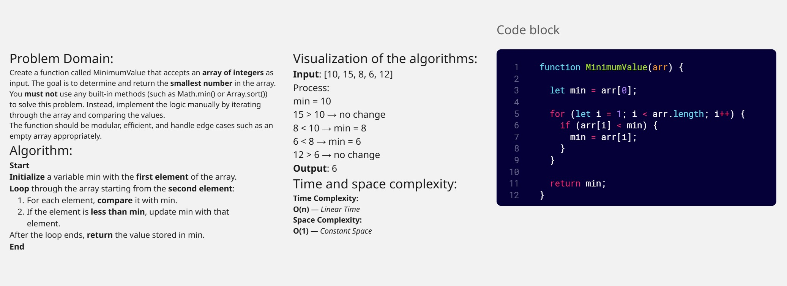

## Challenge 2: Minimum Value 

Write a function called MinimumValue that accepts an array of integers. Without using any built-in methods, the function should return the smallest value in the array.

