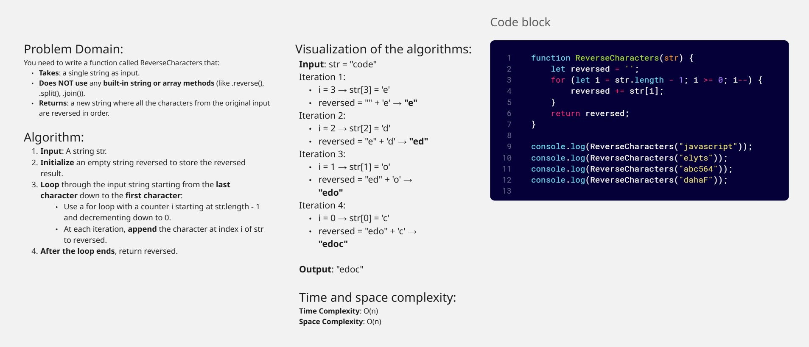
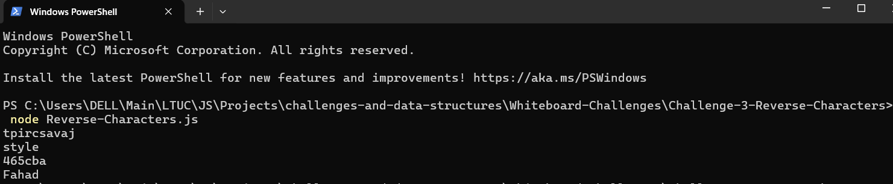

## Challenge 3: Reverse-Characters 

Write a function called ReverseCharacters that takes a single string as input.
Without using any built-in methods, the function should return the string with all characters reversed.

